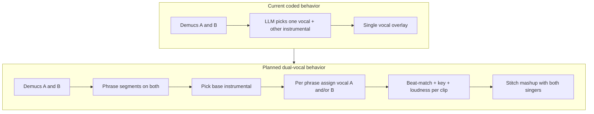

# Improve Mashup POC from AutoMashUpper

## Dual-vocals clarification (your listening test)

**Not chance — coded that way.** Today the pipeline deliberately picks **one** vocal stem and **one** instrumental stem:

- Demucs separates both songs into `vocals` + `no_vocals`
- [`MashupDecision`](services/agent.py) chooses `vocal_source` ∈ {song_a, song_b} and `instrumental_source` as the other
- [`_select_stems`](main.py) returns a **single** `vocal_path` + `instrumental_path`
- Mix overlays only that one vocal onto that instrumental

So you only hear one singer because the product rule is “a cappella from A over bed from B” (or the reverse), not a duet.

### Is the old plan enough for both vocals?

**No.** Phase 1 (beats / local chroma / loudness) improves alignment quality for the **current single-vocal** mix. It does **not** by itself put both singers in the output.

**Phrase detection is necessary** (and with scheduling, sufficient) for a good dual-vocal mashup:

- Blindly stacking both full vocal stems for the whole song usually sounds muddy (AutoMashUpper listening tests also found overlapping vocals often hurt enjoyment).
- Phrase/section structure lets us **feature both singers over time**: e.g. A sings verse regions, B sings chorus regions, or call-and-response on alternating phrases, with optional short harmony stacks only where harmonic mashability is high.

Target product rule going forward: **both vocal stems must appear in the final mashup**, primarily via **phrase-aware assignment**, not “always both at once for the full duration.”

---

## Phase 0 — LLM provider switch (DONE)

Gemini/OpenAI feature flag is implemented. Keep using `LLM_PROVIDER=gemini` locally.

---

## What the paper does (vs what we do now)

AutoMashUpper (Davies et al., 2014):

1. Segments into **phrase sections**
2. Scores **mashability** (harmonic + rhythmic + spectral balance)
3. Finds **local** best windows under key/tempo transforms
4. Aligns with beat-matched stretch, pitch shift, loudness match
5. Can stitch **different material per section**

Our POC today: full-track Demucs → **one** vocal + **one** instrumental → global BPM/key → overlay.

Paper caution about overlapping vocals still applies as a **mixing constraint**, not as “only one singer allowed.” We use phrases to avoid constant collision while still using both singers.

---

## Recommended improvement phases

### Phase 1 — Forced 2-song quality (single-vocal path first)

Keep current API shape; deepen DSP in [services/audio.py](services/audio.py) so later dual-vocal clips align cleanly.

1. Beat tracking + beat-matched stretch (tempo-octave aware)
2. Local harmonic mashability (beat-sync chroma × key rotations → best offset + `n_steps`)
3. Loudness match before overlay
4. Trim/loop to matched section length

Still single-vocal for this phase — foundation for Phase 2.

### Phase 2 — Phrase segmentation + dual-vocal scheduling (required for both singers)

New module e.g. [services/structure.py](services/structure.py); update [main.py](main.py) mix path and [services/agent.py](services/agent.py) decision model.

1. **Phrase-segment both songs** (downbeat-aware Foote novelty / librosa recurrence or bar-grid regularity of 2/4/8 bars).
2. Choose a **base instrumental** (LLM or heuristic: usually the denser / more compatible bed; can still be song A or B `no_vocals`).
3. **Dual-vocal schedule** over base phrases (default policy):
   - **Primary:** alternate / call-response — each phrase features vocal A **or** vocal B (both appear across the song).
   - **Secondary:** where mashability is high, allow a **short harmony overlay** of the other vocal (limited bars, ducked level), not full-duration double-lead.
4. For each scheduled vocal clip: time-stretch to phrase tempo grid, pitch-shift to instrumental key (local chroma), loudness-normalize, then overlay onto that phrase of the instrumental.
5. Stitch phrases into final `mashup.mp3`.
6. Expand `MashupDecision` (or add `DualVocalPlan`) so the LLM can propose:
   - `instrumental_source`
   - `phrase_vocal_policy`: `alternate` | `a_lead_b_harmony` | `b_lead_a_harmony`
   - optional preference for which singer leads verses vs choruses if structure labels exist later

Acceptance criterion: listening to one mashup, **both** song A and song B vocal identities are clearly audible in different sections (and optionally brief harmony moments).

### Phase 3 — Mashability scoring + UI controls

- Weights: harmonic / rhythmic / spectral
- Max key-shift / tempo deviation
- Dual-vocal policy control in UI (`alternate` vs `allow_harmony`)
- Return schedule metadata (which phrase used which vocal) for debugging

### Phase 4 — Optional later

- Library search, Rubber Band, cents tuning, interactive section editor

---

## What not to copy blindly

- Always stacking both full vocals for the entire track
- Ignoring phrase boundaries (Phase 1 alone will not fix “only one singer”)
- Assuming 4/4 / constant tempo without documenting the POC assumption

## Implementation order

1. Phase 0 — DONE (Gemini/OpenAI)
2. Phase 1 — beat/chroma/loudness foundation
3. **Phase 2 — phrases + dual-vocal schedule (answers your singer requirement)**
4. Phase 3–4 — controls and polish
