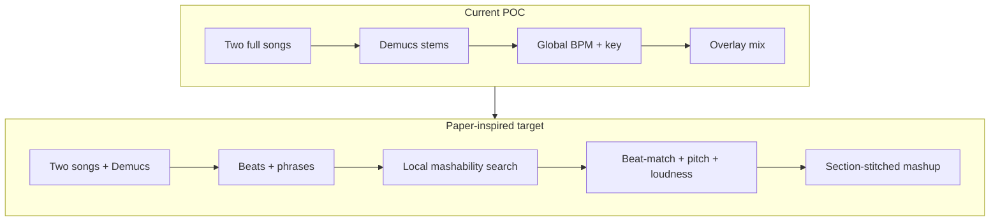

# Improve Mashup POC from AutoMashUpper

## Phase 0 — LLM provider switch (do this first)

OpenAI mashup decisions are failing and falling back. Before AutoMashUpper DSP work, make the strategy agent provider-pluggable.

### Design

- Env flag: `LLM_PROVIDER=openai|gemini` (default `gemini` once Gemini is configured, or `openai` if only OpenAI key exists — **default to `gemini`** when implementing, since that is the requested fix path).
- Keep the same Pydantic model `MashupDecision` and public API `decide_mashup_strategy(song_a_bpm, song_b_bpm)`.
- Implement two backends in [services/agent.py](services/agent.py) (or split `services/llm_openai.py` / `services/llm_gemini.py` if cleaner):
  - **openai**: existing `client.beta.chat.completions.parse` path
  - **gemini**: Google GenAI structured output (JSON schema / response schema matching `MashupDecision`)
- On missing key or API failure for the selected provider: keep deterministic A-vocals / B-instrumental fallback; log which provider failed.
- Never commit real keys. User must put secrets only in local `.env` (gitignored).

### Env / deps

Update [.env.example](.env.example):

```env
LLM_PROVIDER=gemini
OPENAI_API_KEY=
OPENAI_MODEL=gpt-4o-mini
GEMINI_API_KEY=
GEMINI_MODEL=gemini-2.0-flash
```

- Add `google-genai` (or current official Gemini Python SDK) to [requirements.txt](requirements.txt).
- Document the flag in [README.md](README.md).

### Security note

A Gemini API key was pasted in chat. **Do not write that key into the plan, README, or git.** Rotate/revoke it in Google AI Studio if it may have been exposed, then set the new value only in local `.env` as `GEMINI_API_KEY=...`.

### Files

| File | Change |
|------|--------|
| [services/agent.py](services/agent.py) | Provider dispatch + Gemini structured call |
| [.env.example](.env.example) | `LLM_PROVIDER`, `GEMINI_API_KEY`, `GEMINI_MODEL` |
| [requirements.txt](requirements.txt) | Gemini SDK |
| [README.md](README.md) | How to switch providers |

---

## What the paper does (vs what we do now)

AutoMashUpper (Davies et al., 2014) does **not** primarily do vocal-over-instrumental stem mashups. It:

1. Segments an **input song into phrase sections** (downbeat-aligned, typically 2/4/8 bars)
2. Scores **mashability** of each section against candidate material using:
   - **Harmonic** similarity (beat-sync chromagram cross-correlation over key transpositions)
   - **Rhythmic** similarity (kick/snare onset patterns at 12ths-of-a-beat)
   - **Spectral balance** (low/mid/high loudness complementarity)
   - Optional **tempo-range** reward (+ tempo-octave handling)
3. Picks the best **local window** in a candidate (not whole-song average)
4. Aligns with **beat-matched time-stretch**, **pitch shift + tuning**, and **loudness matching**
5. Can stitch **different songs per section** into one multi-song mashup

Our POC today ([main.py](main.py), [services/audio.py](services/audio.py)):

- Full-track Demucs → one vocals stem + one instrumental stem
- LLM chooses which song supplies which stem
- **Global** BPM stretch + **global** root key shift
- Naive `pydub` overlay (no beat grid, no sections, no mashability score)

Important insight from the paper’s listening test: **overlapping vocals** hurt enjoyment correlation. Our Demucs “one vocal + one instrumental” design already avoids that better than full-song layering—keep it.



## Recommended improvement phases (after Phase 0)

### Phase 1 — Forced 2-song quality (highest ROI, keep current API)

Stay on `POST /api/mashup` with two uploads; deepen DSP in [services/audio.py](services/audio.py) (+ small helpers).

1. **Beat tracking** (librosa `beat_track` → beat times for each stem/song).
2. **Beat-matched stretch** instead of a single constant `stretch_factor`:
   - Map candidate beat times onto target beat grid (paper uses Rubber Band; we can approximate with piecewise stretch or add `pyrubberband` if ffmpeg/rubberband is available).
3. **Local harmonic mashability** (paper’s core novelty):
   - Beat-sync chromagrams via `librosa.feature.chroma_stft` / `chroma_cqt`
   - Cross-correlate a vocal (or input) chroma patch against the instrumental track across **beat offsets** and **12 key rotations**
   - Choose best window + best `n_steps` (replace today’s whole-song `get_key` / root-only match)
4. **Tempo octave handling**: if BPMs are near 2×, prefer half/double beat grid over extreme stretch (paper §III intro).
5. **Loudness match**: ReplayGain-style or RMS/LUFS normalization before overlay so one stem doesn’t bury the other (paper §III-E).
6. **Trim/loop to matched section length** so we don’t always dump full mismatched song lengths on top of each other.

LLM role can shrink to “which stem is vocal vs instrumental” (or stay as-is); **alignment should be signal-driven**, not LLM-driven.

### Phase 2 — Phrase-section mashups (paper’s multi-region idea)

Add phrase segmentation on the **instrumental** (or “base”) track:

- Foote-style novelty on a self-similarity matrix of beat-/downbeat-synchronous features (librosa already supports novelty/segmentation patterns; we can start simpler with agglomerative / recurrence segmentation).
- For each phrase of the base track, find the best local window in the other song’s complementary stem.
- Time-stretch/pitch-shift **per section**, then concatenate.
- Optional: allow both songs to contribute different sections (true multi-song mashup) while still using Demucs to avoid dual-vocal collisions.

Touches: new `services/structure.py`, pipeline changes in [main.py](main.py), UI progress stages in [static/app.js](static/app.js).

### Phase 3 — Explicit mashability scoring + UI controls

Expose paper-style controls (even for 2-song forced mode):

- Weights: harmonic / rhythmic / spectral (defaults harmonic-heavy, as in the paper)
- Max key-shift range (e.g. ±6)
- Max tempo deviation
- Return mashability score + chosen section offsets in API JSON metadata (or response headers) for debugging
- UI sliders on [static/index.html](static/index.html) mirroring AutoMashUpper’s center panel (simplified)

Rhythmic feature: kick/snare-ish onset envelopes (HPSS + onset strength), subsampled 12× per beat, cosine similarity—ported lightly from paper §III-B.

Spectral balance: 3-band beat-sync energy flatness (§III-C).

### Phase 4 — Optional later expansions (lower priority)

- Song **library / collection search** (paper’s main ranking use case)—out of scope for current 2-file API unless you add a corpus.
- Fine **tuning correction** (cents) beyond integer semitones (NNLS-style tuning in paper).
- Interactive section editor (swap/delete section matches)—large UI project.
- Rubber Band for higher-quality stretch/pitch than librosa.

## What not to copy blindly

- Full MATLAB/Sonic Annotator NNLS chroma stack — recreate with librosa.
- Multi-hundred song search — unnecessary until you have a library.
- Mixing **two full mixes** with vocals overlapping — paper listeners disliked that; our stem approach is an improvement to keep.
- Assuming constant 4/4 — document as a POC assumption (paper does too).

## Implementation order

1. **Phase 0** — Gemini/OpenAI feature flag (unblocks strategy without OpenAI)
2. **Phase 1** — beats, local chroma, loudness (first AutoMashUpper DSP slice)
3. Phases 2–4 as follow-ups

Leave phrase stitching and weighted mashability UI for Phase 2–3 once Phase 1 sound quality is clearly better.
